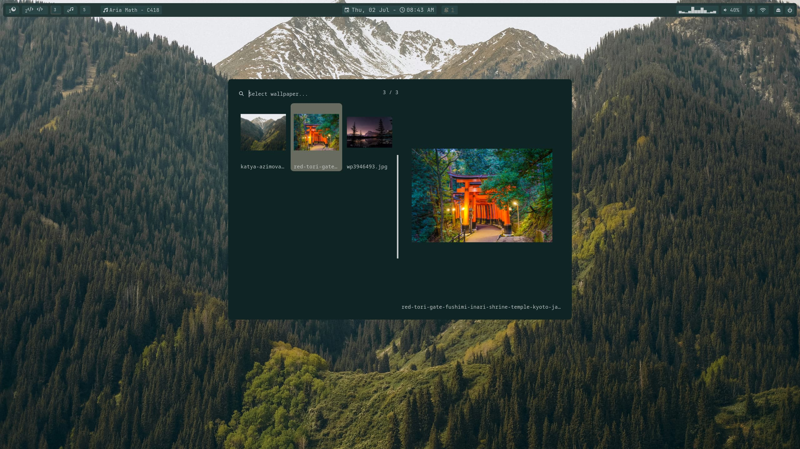

# About
**Theme Sw1tcher** is a small script that extracts the colors from the current wallpaper and applies them to all applications in the environment.

# Preview

# 🛠️ Tech Stack

### 📦 Core Dependencies (Pacman)

| Package                                                                                               | Description                                        |
| :---------------------------------------------------------------------------------------------------- | :------------------------------------------------- |
| 🚀 [yay](https://github.com/Jguer/yay)                                                                 | AUR helper and pacman wrapper                      |
| 🔤 [ttf-jetbrains-mono-nerd](https://github.com/ryanoasis/nerd-fonts)                                  | Developer font with specialized glyphs and icons   |
| 🎨 [qt5ct](https://sourceforge.net/projects/qt5ct/) / [qt6ct](https://sourceforge.net/projects/qt5ct/) | Qt5 and Qt6 configuration utilities                |
| 🔍 [rofi](https://github.com/davatorium/rofi)                                                          | Window switcher and application launcher           |

### 🛸 AUR Dependencies (Yay)

| Package                                                                              | Description                                         |
| :----------------------------------------------------------------------------------- | :-------------------------------------------------- |
| 🖼️ [awww](https://codeberg.org/LGFae/awww)                                        | Dynamic wallpaper generator and wrapper             |
| 🌈 [python-pywal16](https://github.com/eylles/pywal16)                                | Color palette generation from images (Pywal fork)   |
| 🛠️ [wpgtk](https://github.com/deviantfero/wpgtk)                                      | Universal theme template manager using Pywal        |
| 🕶️ [nwg-look](https://github.com/nwg-piotr/nwg-look)                                  | GTK3/4 configuration customization tool for Wayland |
| 🎨 [papirus-icon-theme](https://github.com/PapirusDevelopmentTeam/papirus-icon-theme) | Material design icon theme for Linux                |
| 🌌 [kvantum](https://github.com/tsujan/Kvantum)                                       | SVG-based theme engine for Qt5/Qt6                  |